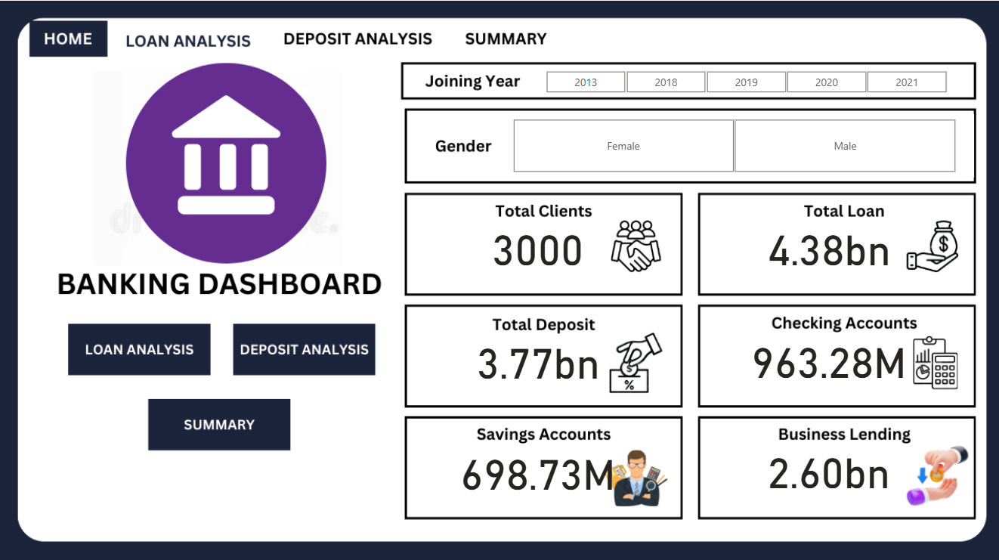
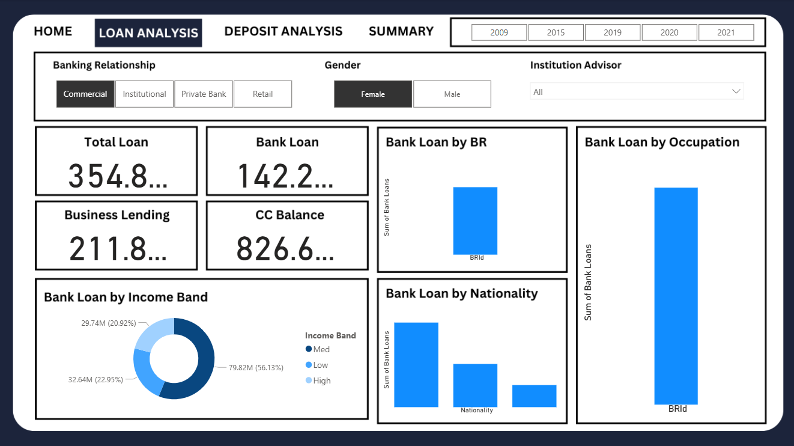
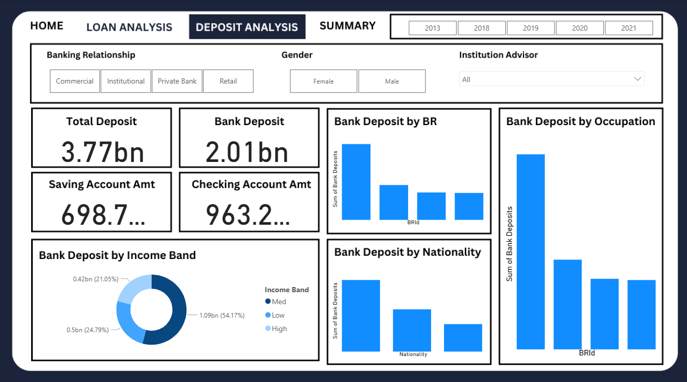
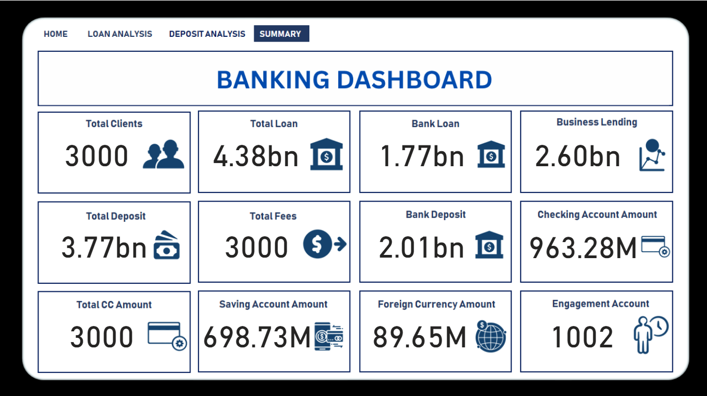

# Comprehensive-Banking-Risk-Analysis-Using-EDA-and-BI-Tools
An end-to-end data analytics project focused on risk analysis in banking, combining Python, SQL, and PowerBI. This project demonstrates the complete data pipeline: from data cleaning and exploratory data analysis (EDA) to dashboard design and development.

# My Project

Here are some screenshots:

### 📸 Dashboard Screenshot

---

## 📌 Project Overview

This project aims to analyze customer banking data to assess and mitigate lending risk. It follows a structured data analytics workflow:

- Data Cleaning & Preparation using **Python**
- Exploratory Data Analysis (EDA)
- SQL Database Integration with **MySQL**
- Visualization & Dashboarding with **PowerBI**
- Application of **banking domain knowledge** for insight generation

---

## 📂 Dataset Description

The dataset contains 3,000 records and 25 columns, including:

- Demographics: age, gender, nationality
- Financial Info: estimated income, credit card balances, loans, deposits
- Banking Attributes: account type, relationship ID, advisor ID

---

## 🔧 Technologies Used

| Tool      | Purpose                          |
|-----------|----------------------------------|
| Python    | Data cleaning & analysis         |
| MySQL     | Database storage & querying      |
| PowerBI   | Dashboard creation & KPIs        |
| Pandas    | Data manipulation in Python      |
| Seaborn   | Data visualization in Python     |

---

## 📊 Exploratory Data Analysis (EDA)

EDA techniques applied:

- Univariate & Bivariate Analysis
- Histograms and Countplots
- Correlation Heatmaps
- Categorical Binning (e.g., income bands)

---

## 🛢 SQL & Python Integration

Simulated a real-world data pipeline:
- Uploaded CSV into MySQL
- Connected MySQL with Python using `mysql.connector`
- Queried and manipulated data via SQL + Pandas

---

## 🖥️ PowerBI Dashboard

Built an interactive dashboard with multiple pages:

- **Homepage**: Summary KPIs, slicers, navigation buttons
- **Loan Analysis**: Loans by income, relationship, occupation
- **Deposit Analysis**: Breakdown of deposits across accounts
- **Summary Page**: Overall metrics and insights

Design elements included:
- Custom background (via Canva)
- Cards, slicers, pie/bar charts
- Navigation buttons for smooth UX

---

## 💡 Key Learnings

- Applied domain knowledge to derive total loan & deposit metrics
- Practiced storytelling through visual dashboards
- Understood importance of sketching and iterative design
